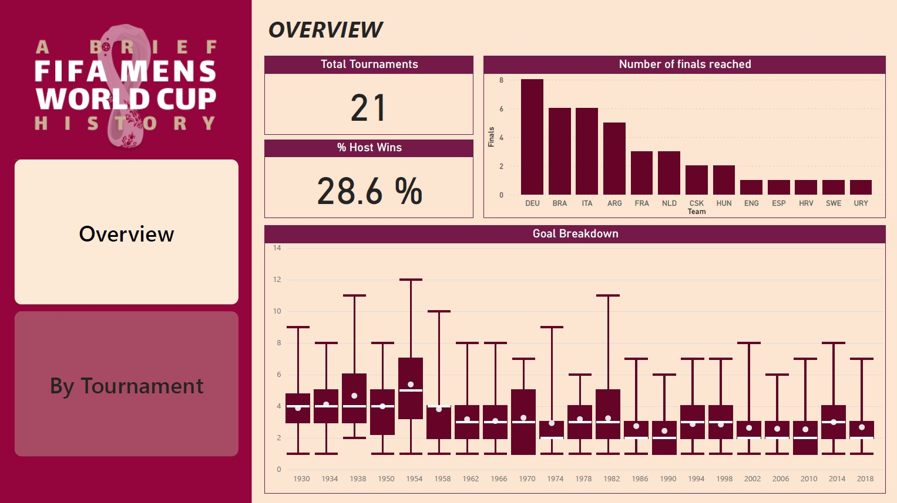

# Day 45. 100 Days of Data Science Challenge - 03/17/2025

# ⚽ FIFA World Cup Analysis Dashboard – Power BI  

## 🌟 Project Overview  

The **FIFA World Cup** is the **biggest sporting event on the planet**, but have you ever wondered:  

🏆 **Which country has dominated the World Cup over time?**  
🎯 **Which nation has scored the most goals?**  
📊 **Does playing as the host nation provide an advantage?**  

This project is an **interactive Power BI dashboard** that brings FIFA World Cup history to life. With extensive **DAX calculations, tooltips, and dynamic filters**, this dashboard provides **deep insights** into historical match data, team performance, and goal statistics.  

🚀 **Key Highlights:**  
✔️ **Custom visualizations for in-depth analysis**  
✔️ **DAX-powered metrics for advanced calculations**  
✔️ **Interactive tooltips & slicers for deep exploration**  
✔️ **Geospatial mapping for match locations**  

---

## 🎯 What You Will Learn  

Through this project, you will:  
✅ **Perform exploratory data analysis (EDA) in Power BI**  
✅ **Master DAX functions for complex metric calculations**  
✅ **Use advanced Power BI interactions for enhanced data exploration**  
✅ **Create a visually stunning and insightful dashboard**  

This dashboard is **not just a report—it’s an interactive story of football history!**  

---

## ⚽ Key Questions Answered  

🔹 **Which country scored the most goals?**  
🔹 **Which country reached the most finals?**  
🔹 **Which World Cup had the most goals scored?**  
🔹 **Do host countries have an advantage in winning?**  

---

## 📊 Power BI Dashboard Features  

### **1️⃣ Overview Page**  
📌 Displays **high-level tournament statistics**  
📌 Tracks **total goals, winners, and team performance**  

### **2️⃣ Tournament Breakdown**  
📌 Compares **team performance across different World Cups**  
📌 Visualizes **finals reached per country**  

### **3️⃣ Goal Analysis**  
📌 **Bar charts & heatmaps** to analyze goal distribution per team  
📌 **Year-wise goal trends** to identify high-scoring tournaments  

### **4️⃣ Host Nation Performance**  
📌 **Win percentage of host countries** vs. non-hosts  
📌 **Trend analysis on host advantage over the decades**  

### **5️⃣ Geospatial Analysis**  
📌 **Map visualizations of match locations**  
📌 Clickable **stadium-based filtering**  

---

## Example - Key Insights & Findings for 1998 World Cup

| **Metric**               | **Top Country** |  
|--------------------------|----------------|  
| **Most Goals Scored**    | 🇩🇪 **Germany** (DEU) |  
| **Most Finals Reached**  | 🇧🇷 **Brazil** (BRA) |  
| **Highest Goal-Scoring Year** | **World Cup 1998** |  
| **Host Nation Win Percentage** | **28.6%** |  

### ✨ Example Observations - 1998 World Cup  

- **Germany has dominated in goal-scoring**, even outperforming Brazil.  
- **Brazil reached the most finals**, proving consistent elite performance.  
- **The 1998 World Cup had the highest goals scored**, showcasing an offensive era.  
- **Host nations won 28.6% of the time**, proving a slight but real advantage.  

---

## 🚀 Technologies & Tools  

| **Tool**         | **Purpose**                              |  
|-----------------|-----------------------------------------|  
| **Power BI**    | Dashboard creation & visualization      |  
| **DAX**         | Custom metric calculations              |  
| **Excel/CSV**   | Data preprocessing & integration       |  

---

## 🎨 Dashboard Snapshots  

| **Dashboard Section** | **Preview** |  
|----------------------|------------|  
| **Overview Page**  |  |  
| **Tournament Page**  |  |  

🚀 **[View Full Dashboard Here](https://github.com/vatsalparikh07/100-days-of-data-science-challenge/main/Dayy%2045.%20Exploring%20FIFA%20World%20Cup%20Data%20in%20Power%20BI/solution.pbix)**  

---

## 🚧 Challenges & Solutions  

### Challenge: **Handling Large Tournament Data**  
✅ **Solution:** Used **DAX aggregations** for performance optimization  

### Challenge: **Dynamic Filtering for Team Stats**  
✅ **Solution:** Created **interactive slicers & drill-through pages**  

### Challenge: **Mapping Tournament Matches Geographically**  
✅ **Solution:** Integrated **Bing Maps API** with match locations  

---

## 💡 Future Enhancements  

🔹 **Predictive Analytics:** Use machine learning to **forecast World Cup winners**  
🔹 **Player-Level Analysis:** Add player-specific **goal contributions**  
🔹 **Live Data Integration:** Connect to an **API for real-time updates**  

---

### ✨ Final Thoughts  

This **Power BI FIFA Dashboard** brings the magic of **football analytics** to life. By combining **DAX-powered calculations**, **interactive filtering**, and **data storytelling**, this project provides **actionable insights** into **World Cup history**.  

📢 **Let’s connect!** If you're passionate about **sports analytics, Power BI, or data visualization**, let’s discuss! 😊 
