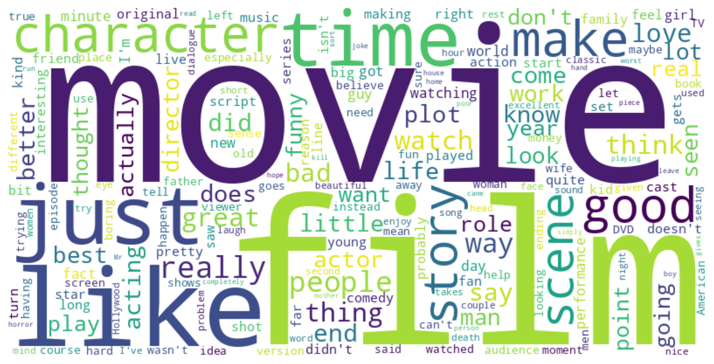
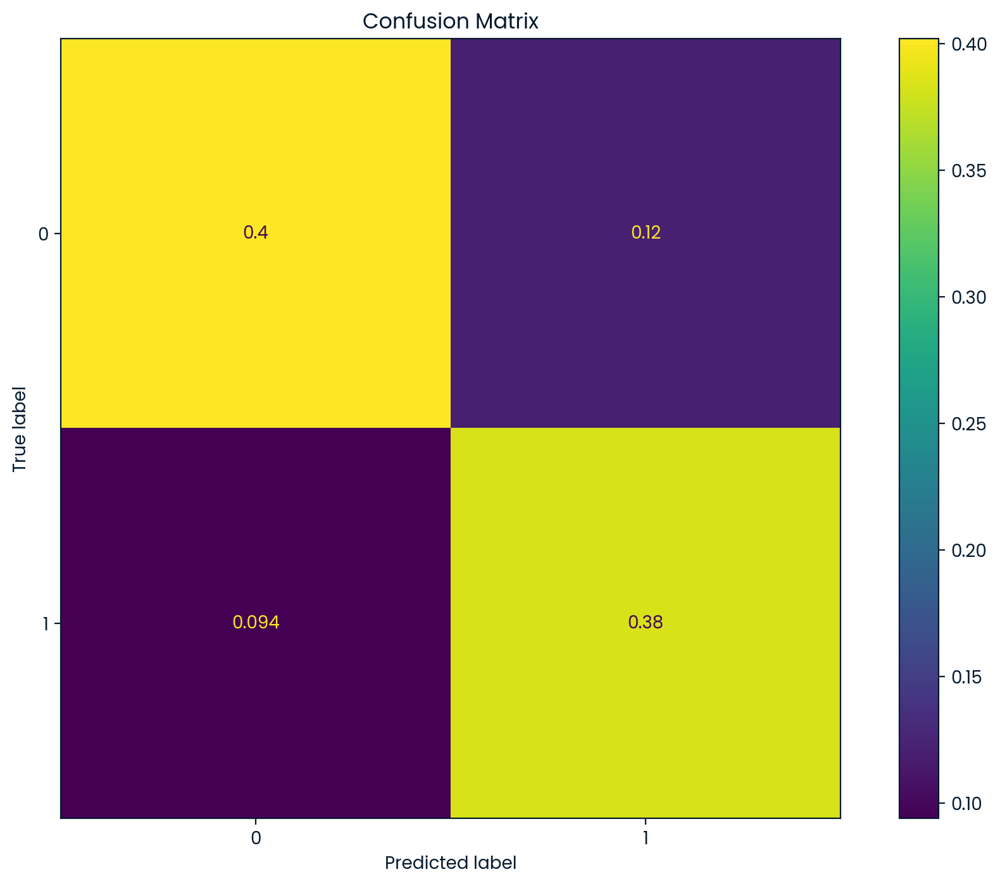

# Day 50. 100 Days of Data Science Challenge - 03/22/2025
# 🎭 Sentiment Analysis & Prediction – Movie Reviews with ML  

## 🌟 Project Overview  

Sentiment analysis is one of the most **powerful applications of Natural Language Processing (NLP)**, enabling machines to **interpret human emotions** from text.  

This project focuses on **predicting sentiment from movie reviews** using:  
✅ **TF-IDF Vectorization for feature extraction**  
✅ **Random Forest Classifier for sentiment prediction**  
✅ **Word Cloud for text visualization**  
✅ **Confusion Matrix & Feature Importance for model evaluation**  

---

## 🎯 Key Objectives  

- **Analyze sentiment polarity** in movie reviews (positive/negative).  
- **Preprocess text data** efficiently using **TF-IDF vectorization**.  
- **Train and evaluate a machine learning model** for sentiment classification.  
- **Interpret model predictions** using feature importance analysis.  

---

## 📂 Dataset Overview  

| **Attribute** | **Description** |  
|-------------|----------------|  
| `text`  | The movie review content (raw text). |  
| `label` | Sentiment label (0 = negative, 1 = positive). |  

🔹 **Dataset Size:** 4,000 movie reviews  
🔹 **Balanced Distribution:** ~50% positive, ~50% negative  

---

## 🛠 Analytical Approach  

### **1️⃣ Data Exploration & Cleaning**  
📌 **Checked for missing values & class balance**.  
📌 **Created word cloud visualizations** to identify key words.  

### **2️⃣ Text Preprocessing**  
📌 Used **TF-IDF Vectorization** to extract features from text.  
📌 Considered **unigrams & bigrams** for better context understanding.  

### **3️⃣ Feature Engineering**  
📌 Extracted **character count, word count, and average word length**.  
📌 Combined **TF-IDF scores with text-based statistical features**.  

### **4️⃣ Model Training & Evaluation**  
📌 Used **Random Forest Classifier** for sentiment prediction.  
📌 Evaluated model performance using **Precision, Recall, F1-score, and Accuracy**.  
📌 Visualized results using a **Confusion Matrix**.  

### **5️⃣ Feature Importance Analysis**  
📌 Identified the **most impactful words** for classification.  
📌 Examined how words like "bad," "worst," and "great" influenced predictions.  

---

## 📊 Key Results  

| **Metric**  | **Score**  |  
|------------|-----------|  
| **Accuracy** | **79%** |  
| **Precision (Positive Sentiment)** | **0.76** |  
| **Recall (Positive Sentiment)** | **0.80** |  
| **F1-Score (Overall)** | **0.78** |  

### ✨ Observations  

📌 **"Bad" and "worst" were the strongest indicators of negative sentiment.**  
📌 **"Great" and "excellent" were key predictors of positive sentiment.**  
📌 The **Random Forest model performed well**, achieving **79% accuracy**.  

---

## 🚀 Visualizations  

### **Word Cloud – Frequent Words in Movie Reviews**  
  

### **Confusion Matrix – Model Predictions**  
  

---

## 🚧 Challenges & Solutions  

### Challenge: **Handling Stop Words & Common Terms**  
✅ **Solution:** Used **TF-IDF to penalize frequently occurring words**.  

### Challenge: **Model Overfitting**  
✅ **Solution:** Limited **max features in TF-IDF** and optimized hyperparameters.  

### Challenge: **Interpreting Model Decisions**  
✅ **Solution:** Analyzed **feature importance scores** to explain predictions.  

---

## 💡 Future Enhancements  

🔹 **Deep Learning Upgrade** – Use **BERT or LSTM** for sentiment analysis.  
🔹 **Aspect-Based Sentiment Analysis** – Identify **specific movie elements (e.g., acting, direction) that impact sentiment**.  
🔹 **Real-Time Sentiment Analysis API** – Deploy a **Flask-based app for live reviews analysis**.  

---

### ✨ Final Thoughts  

This project demonstrates how **machine learning can analyze and predict sentiment from movie reviews**, turning text into actionable insights.  

💡 **The future of AI in NLP is beyond classification—it’s about understanding human emotions at scale.**  

📢 **Let’s connect!** If you're passionate about **NLP, AI-driven sentiment analysis, or text mining**, let’s discuss! 😊  

